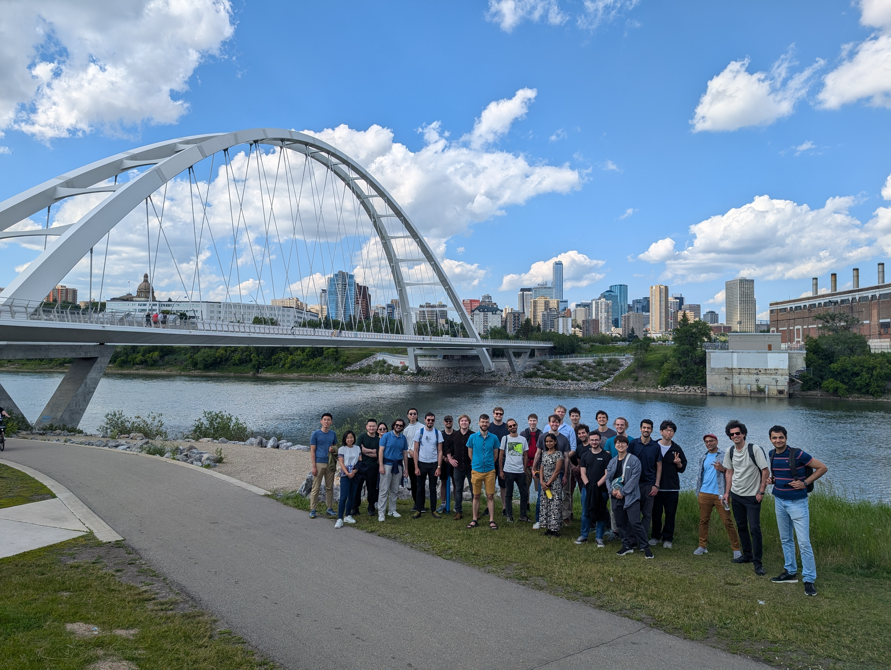

# The second RL theory workshop (co-located with COLT 2024)

Our second\* RL theory workshop took place 27-29 June 2024 at the University of Alberta. *Project Eva,* Jack Mayo and Daniel Abrahamian's startup, sponsored the event.

*David Janz, Alex Ayoub & Csaba Szepesvári*

\*Recordings from the previous workshop are available [here](https://www.youtube.com/playlist?list=PLOtn0gtfk-RnuiDoj7oDP9LZ7pdOj5vtO). 

## Talks list

June 28th am:
- *Truncated Variance Reduced Value Iteration,* 1hr, **Ishani Aniruddha Karmarkar**, [video](https://youtu.be/00GUPKciqJw)
- *Optimistic Q-learning for average reward and episodic RL,* 1hr, **Shipra Agrawal**, [video](https://youtu.be/bZpX78DyIFU)
- *Uncertainty-Aware Reward-Free Exploration with General Function Approximation,* 30min, **Dongruo Zhou**, [video](https://youtu.be/Rt1ObA8F30w)
- *On the Instance-dependent Sample Complexity of Tabular RL*, 30min **Kevin Jamieson**, [video](https://youtu.be/3jUnzscI8xg)

June 28th pm:
- *Scalable Online Exploration via Coverability,* 30min **Philip Amortila**, [paper link](https://arxiv.org/abs/2403.06571), [video](https://youtu.be/HMdAP9zGL4Q)
- *Statistical and Algorithmic Reductions for Reinforcement Learning From Rich Observations,* 30min, **Philip Amortila**, [video](https://youtu.be/nc6NZDLDCbw)
- *Bisimulation Metrics are Optimal Transport Distances, and Can be Computed Efficiently,* 45min **Gergely Neu**, [video](https://youtu.be/fdNQ_L5mWxI)
- *Towards Principled, Practical Policy Gradient for Bandits and Tabular MDPs,* 30min **Sharan Vaswani**, [video](https://youtu.be/7lWpCZl-E4E)
- *Self-Play Preference Optimization for Language Model Alignment,* 30min **Quanquan Gu**, [video]()

June 29th am:
- *A Computationally Efficient Algorithm for Infinite-Horizon Average Reward Reinforcement Learning with Linear MDPs,* 1hr, **Ki Hong**, [video](https://youtu.be/jCZC5j54fpM)
- *Offline Reinforcement Learning: Role of State Aggregation and Trajectory Data,* 1hr, **Zeyu Jia**, [paper link](https://arxiv.org/abs/2403.17091), [video](https://youtu.be/Mxf6hfWlJx4)
- *Efficient exploration in deep RL via utility theory,* 45min, **Brendan O'Donoghue**, [video](https://youtu.be/jCZC5j54fpM)

June 29th pm:
- *Robust Online Learning in the Presence of Outliers,* 30min, **Tim van Erven**, [paper link](https://arxiv.org/abs/2107.01881), (video recording failed)
- *Reinforcement Learning in Mean Field Games: the pitfalls and promises,* 30min, **Niao He**, [video](https://youtu.be/FxJky3PsuD4)
- *When are Offline Multi-Agent Games Solvable?,* 30min, **Simon Du**, [video](https://youtu.be/HWrxdSxh6PQ)
